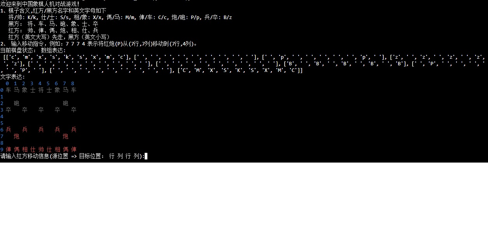

# deepseek-chess

希望达成可deepseek下象棋。


通过纯文本引导deepseek写的一个简单的中国象棋引擎。

**棋子含义**：

将/帅: K/k, 仕/士: S/s, 相/象: X/x, 傌/马: M/m, 俥/车: C/c, 炮/砲: P/p, 兵/卒: B/z
红方（大写）先走，黑方（小写）为 AI。

输入移动指令，例如：7 7 7 4 表示将红炮(P)从(7行,7列)移动到(7行,4列)。



欢迎来到中国象棋人机对战游戏！
1、棋子含义,红方/黑方名字和英文字母如下
```
   将/帅: K/k, 仕/士: S/s, 相/象: X/x, 傌/马: M/m, 俥/车: C/c, 炮/砲: P/p, 兵/卒: B/z
   黑方： 将、车、马、砲、象、士、卒
   红方： 帅、俥、傌、炮、相、仕、兵
   红方（英文大写）先走，黑方（英文小写）
```
2、 输入移动指令，例如：7 7 7 4 表示将红炮(P)从(7行,7列)移动到(7行,4列)。
当前棋盘状态： 数组表达:
```python
 [['c', 'm', 'x', 's', 'k', 's', 'x', 'm', 'c'], 
 [' ', ' ', ' ', ' ', ' ', ' ', ' ', ' ', ' '], 
 [' ', 'p', ' ', ' ', ' ', ' ', ' ', 'p', ' '], 
 ['z', ' ', 'z', ' ', 'z', ' ', 'z', ' ', 'z'], 
 [' ', ' ', ' ', ' ', ' ', ' ', ' ', ' ', ' '], 
 [' ', ' ', ' ', ' ', ' ', ' ', ' ', ' ', ' '], 
 ['B', ' ', 'B', ' ', 'B', ' ', 'B', ' ', 'B'], 
 [' ', 'P', ' ', ' ', ' ', ' ', ' ', 'P', ' '], 
 [' ', ' ', ' ', ' ', ' ', ' ', ' ', ' ', ' '], 
 ['C', 'M', 'X', 'S', 'K', 'S', 'X', 'M', 'C']]
 ```
文字表达:
```
  0  1  2  3  4  5  6  7  8
0 车 马 象 士 将 士 象 马 车
1
2    砲                砲
3 卒    卒    卒    卒    卒
4
5
6 兵    兵    兵    兵    兵
7    炮                炮
8
9 俥 傌 相 仕 帅 仕 相 傌 俥
请输入红方移动信息(源位置 => 目标位置： 行 列 行 列):
```